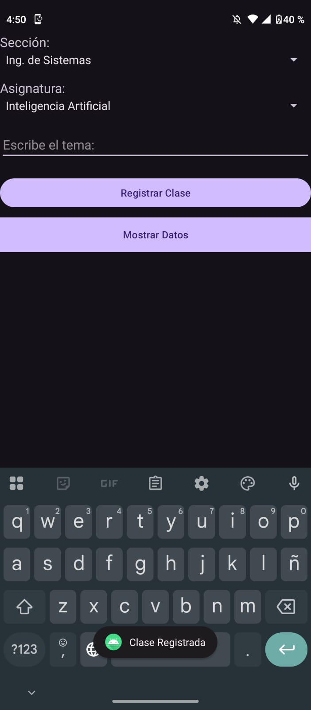
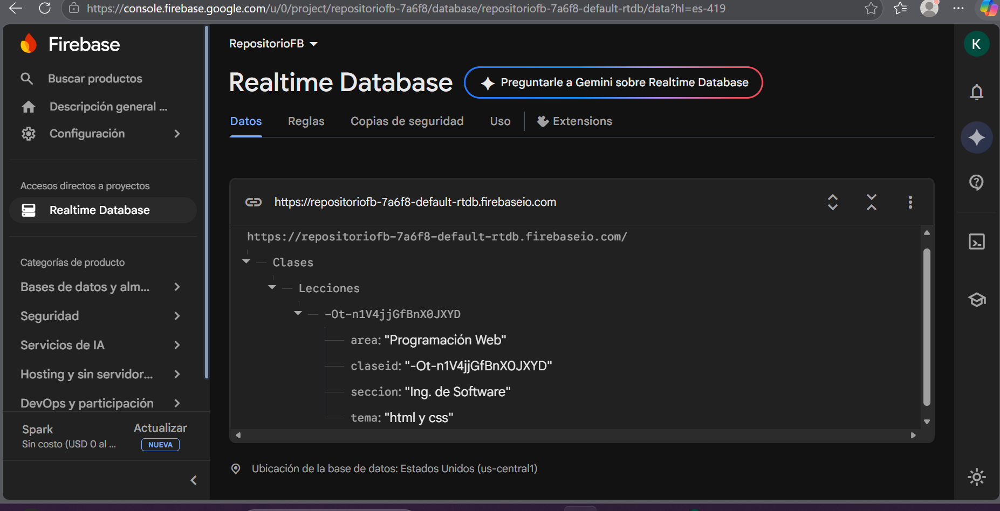
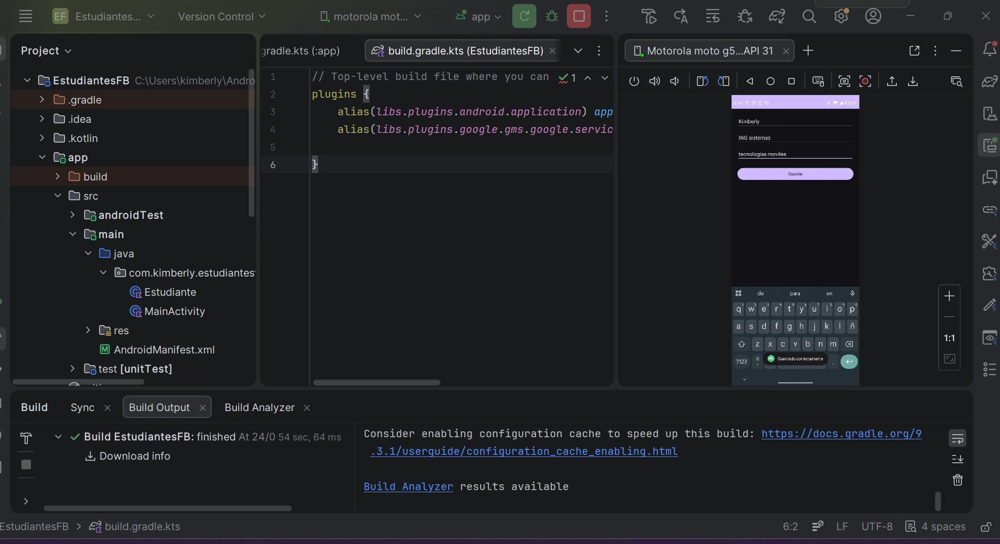
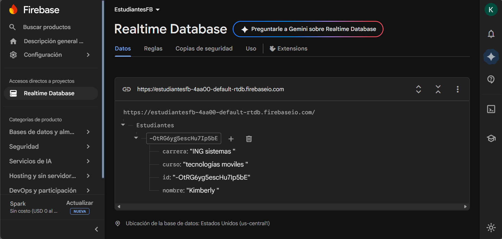
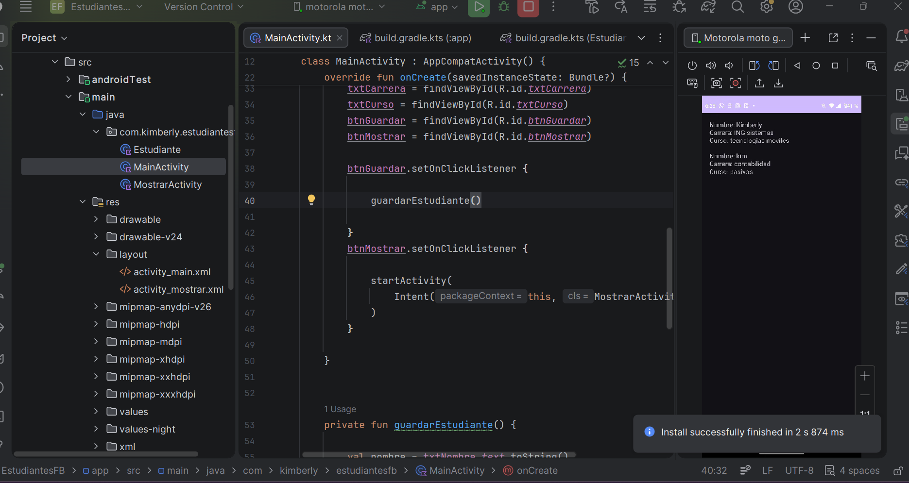
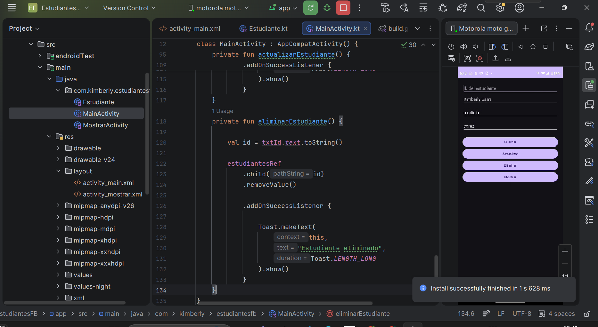

# Firebase Realtime Database – Actividad y Ejercicios

Aplicación móvil desarrollada en Android Studio utilizando Kotlin y Firebase Realtime Database.  
La práctica consiste en conectar una aplicación Android con Firebase para registrar, mostrar y gestionar información en tiempo real.

---

# Tecnologías Utilizadas

- Kotlin
- Android Studio
- Firebase Realtime Database
- XML
- Firebase BoM 34.13.0

---

# Configuración del Proyecto

| Configuración | Valor |
|---|---|
| compileSdk | 35 |
| targetSdk | 35 |
| minSdk | 23 |
| Kotlin DSL | Sí |
| Firebase BoM | 34.13.0 |

---

# Firebase Realtime Database

Se utilizó Firebase Realtime Database para almacenar y sincronizar datos en tiempo real.

## Reglas utilizadas

```json
{
  "rules": {
    ".read": true,
    ".write": true
  }
}
```

---

# Actividad 1 – Conexión con Firebase

Desarrollo de una aplicación Android conectada a Firebase Realtime Database para registrar información desde Android Studio usando Kotlin.

## Evidencias

### Aplicación funcionando



### Base de datos Firebase



---

# Ejercicio 1 – Registro de Estudiantes

Se desarrolló una aplicación que permite registrar estudiantes con los siguientes campos:

- Nombre
- Carrera
- Curso

Los datos son almacenados en Firebase utilizando:

```kotlin
push()
setValue()
```

## Evidencias

### Registro de estudiantes



### Firebase Database



---

# Ejercicio 2 – Mostrar Estudiantes en Tiempo Real

Se implementó una segunda pantalla que muestra los estudiantes registrados en Firebase utilizando:

```kotlin
ValueEventListener
```

La aplicación se actualiza automáticamente cuando existen cambios en la base de datos.

## Evidencias



---

# Ejercicio 3 – CRUD Completo

Se implementaron las operaciones CRUD completas sobre Firebase Realtime Database.

---

## CREATE

Registro de estudiantes usando:

```kotlin
push()
setValue()
```

---

## READ

Lectura en tiempo real utilizando:

```kotlin
addValueEventListener()
```

---

## UPDATE

Actualización de datos mediante:

```kotlin
updateChildren()
```

---

## DELETE

Eliminación de registros usando:

```kotlin
removeValue()
```

---

## Evidencias



---


# Autor
Kimberly Barra Q.
---
Proyecto desarrollado en Kotlin utilizando Firebase Realtime Database.
